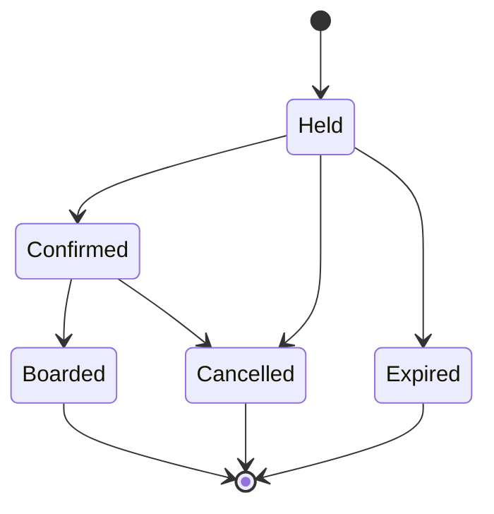
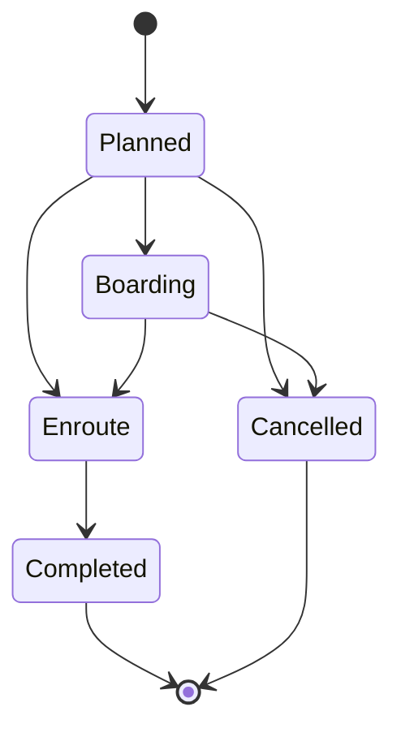

# Refactoring Prompt: Align Code with 16-Bus Architecture

**Executive Summary:** The 16-Bus backend is well-structured and feature-rich, but its core **domain logic** is fragmented and lacks strict enforcement of the business rules outlined in the architecture doc. The next steps must focus on building **strong aggregates** and **centralized rules** so that invariants (route ownership, valid stop sequences, cash rules, single-use QR scans, etc.) are guaranteed by design. This prompt describes concrete refactor tasks, deliverables, and tests to transform the code into a true domain-driven system, with explicit state machines for bookings and trips. 

## Goals & Scope

- **Goals:** Enforce business invariants in code; convert scattered logic into clear **Domain** layer responsibilities; emit and handle domain events for major transitions; stabilize the trip and booking lifecycles. 
- **Scope:** Core backend refactor (domain models/services, application logic, event system, and tests). Focus on booking, trip, dispatch, and queue flows. Ensure API remains functional but shift decision logic into domain. 
- **Non-Goals:** No new features (UI, additional endpoints, or performance optimization) beyond what’s needed to satisfy rules. No changes to the external system integrations or deployment.

## Acceptance Criteria

1. **Invariant Enforcement:** All rules from the architecture doc (e.g. vehicle-org matches route, stop order validity, payment constraints, QR one-time use) are enforced in domain code. A passenger can never board without a valid QR or when rules forbid it.  
2. **Clear Layer Separation:** The **Application** layer only orchestrates use cases (auth, transactions, role checks) and delegates decisions to **Domain**. No core business rules remain in API or application.  
3. **State Machines Explicit:** Trip and Booking lifecycles are enforced by domain state machines (no illegal transitions).  The system will reject or log any out-of-order state change.  
4. **Domain Events Emitted:** Key actions emit domain events (e.g. `booking.held`, `booking.confirmed`, `trip.departed`), which can be consumed by workers (for notifications, reconcilation, analytics, etc.). 
5. **Comprehensive Tests:** New or updated tests validate all business rules and state transitions. For example, attempting to board twice or to pay cash off-rank must fail. Existing tests (bookings, dispatch, etc.) still pass; plus tests for new rules.  

## Deliverables

| **File Path**                              | **Change / New Content**                                                                                  |
|-------------------------------------------|------------------------------------------------------------------------------------------------------------|
| `app/domain/bookings/service.py`          | **Update logic:** Embed all booking invariants (stop order, org match, payment vs rank-cash rules). Emit domain events (`booking.held/confirmed/expired/cancelled/boarded`). Remove any leftover rule checks from Application layer.            |
| `app/domain/dispatch/service.py`          | **Extend or replace** with a proper **Dispatch Aggregate:** ensure it verifies route variant validity, ETA/SLA checks and emits events (`trip.matched`, etc.). (Option: split into `app/domain/dispatch/dispatch.py` as an aggregate). |
| `app/domain/ranks/service.py` (new)       | **New service:** Manage rank queue tickets. Assign tickets to trips, enforce FIFO, update states, and emit events (`queue.issued`, `queue.assigned`, `queue.boarded`). Coordinate with `BookingService` for rank-cash bookings.           |
| `app/domain/events.py` (new)              | **New definitions:** Create DomainEvent subclasses or constants (e.g. `BookingHeld`, `BookingConfirmed`, `TripDeparted`, etc.) for all major events. Use them in services to emit structured events.                     |
| `app/domain/bookings/state_machine.py`    | **Enhance state machine:** (Already exists) Document it fully; add missing allowed transitions if needed. Ensure `validate_transition` is used everywhere a status change occurs.                           |
| `app/application/services.py`             | **Refactor:** Remove any direct business logic now in domain. Each ApplicationService (e.g. `BookingApplicationService`) should simply call domain service methods within a transaction.                               |
| `app/workers/consumers.py`                | **Update:** Subscribe to the new domain events if necessary (e.g. pick up `booking.confirmed` to send SMS). Ensure the event handling matches new event definitions.                                       |
| `tests/test_booking_invariants.py` (new)  | **New tests:** Verify core booking rules. For example:  
   - Cannot confirm booking without payment authorization or cash code.  
   - Cannot set origin/destination on wrong route.  
   - Cash-at-rank only applies when origin is a rank.  
   - Forfeit logic (no forfeiture if operator cancels). |
| `tests/test_trip_state_transitions.py` (new) | **New tests:** Ensure no illegal trip state transitions (e.g. planned → completed directly). Simulate trip lifecycle, verify events, seat counts, and state changes.                                   |
| `tests/test_queue_flow.py` (new)         | **New tests:** Cover rank queue processing: issuing ticket, assigning to trip, boarding via queue. Confirm one passenger per ticket and proper cancellation.                                    |

*(Paths are relative to repo root. Adjust names if the module structure differs.)*

## Prioritized Refactor Steps

1. **Design Domain Aggregates (3 days):** Identify core aggregates: *BookingAggregate*, *TripAggregate*, *RankQueueAggregate*. For each, define its state and operations. Move logic from services into aggregate methods. For example, in `BookingService`, factor out booking creation/confirmation rules into `BookingAggregate.reserveSeats()`, `BookingAggregate.confirm()`, etc.  
2. **Enforce Domain Rules (2 days):** Implement the invariants from section 14 of the architecture doc as assertions or exceptions in domain code. For instance, in `BookingService.create_booking`, check that `origin_stop` and `destination_stop` are valid on the route (can call `RouteRepository.validate_stop_order`). In `TripService`, prevent starting a trip if `vehicle.organization_id != trip.organization_id`. Any violation should raise a `DomainRuleViolationError`.  
3. **Implement State Machines (1 day):** Make state machines authoritative. Use the existing `validate_transition` functions at all state changes (booking state and trip state). E.g., in the QR scanning handler (`QRService.issue_for_booking` or API), ensure a boarding scan calls `validate_transition(booking.state, BOOKED)`. Fill any missing transitions if the architecture spec requires more states.  
4. **Introduce Domain Events (1 day):** Formalize domain events. Replace raw strings with `DomainEvent("booking.held", ...)` or specialized classes. Emit events on **every** state change (held, confirmed, boarded, trip departed, etc.). Update consumers (in `workers/consumers.py`) to listen to these event types.  
5. **Build Rank Queue Logic (2 days):** Complete the `RankQueueTicket` workflow: when a rank passenger arrives, a ticket is created (`state=ISSUED`), then assigned to a `trip_id` (`state=ASSIGNED`), and finally marked `BOARDED` after boarding scan. Enforce FIFO ordering by `queue_number`. Emit events at each step. Integrate this with booking (a rank-cash booking should generate a queue ticket rather than a regular booking record until paid).  
6. **Refine Application Layer (1 day):** Audit `app/application/services.py` to ensure no business rules remain there. All calls to domain services should be wrapped in transactions (`self.transact`). For example, after moving logic into domain, the application services might simply do `return self.transact(lambda: self.service.create_booking(...))`.  
7. **Add Tests (2 days):** Write the new tests listed above. Also update any existing tests if behavior has changed (e.g. if booking confirmation logic changed, update the booking tests accordingly). Ensure test suite covers: seat reservation/release, QR reuse protection, rank vs app booking distinctions, event emission, and permission checks.  

## Tests to Add/Modify

- **`test_booking_requires_payment_or_rank`** – Attempt to confirm a booking without calling `/bookings/{id}/pay` (for non-rank) or without QR payment (for rank); expect failure.  
- **`test_booking_stop_order_validation`** – Create a booking with origin and destination on different routes or reversed order; expect a domain rule violation.  
- **`test_trip_vehicle_org_mismatch`** – Start a trip where `vehicle.organization_id != trip.organization_id`; expect rejection.  
- **`test_queue_ticket_lifecycle`** – Simulate a rank queue ticket: issue, assign to trip, board, and confirm final state and that excess scans fail.  
- **`test_invalid_trip_state_transition`** – Try illegal transitions (e.g. boarding → planned, completed → boarded); expect `InvalidStateTransitionError`.  

Use the existing PyTest framework; name tests descriptively (e.g. `test_booking_cannot_confirm_without_payment`). 

## Example Domain Events

Use the `DomainEvent` system to emit events on changes. Example event names (and payload fields):

- `booking.held` – when a new booking hold is created. Payload: `{ booking_id, trip_id, party_size, hold_expires_at }`.  
- `booking.confirmed` – when payment is captured. Payload: `{ booking_id, trip_id, passenger_id }`.  
- `booking.cancelled` – on cancellation. Payload: `{ booking_id, trip_id, refund_issued }`.  
- `booking.boarded` – when boarding scan succeeds. Payload: `{ booking_id, trip_id, stop_id, timestamp }`.  
- `trip.started` (or `trip.departed`) – when a trip leaves the origin. Payload: `{ trip_id, vehicle_id, driver_id, timestamp }`.  
- `trip.completed` – on trip end. Payload: `{ trip_id, total_passengers }`.  
- `rank.ticket.issued` – new rank queue ticket. Payload: `{ ticket_id, rank_id, trip_id (nullable) }`.  
- `rank.ticket.boarded` – rank passenger boarded. Payload: `{ ticket_id, trip_id }`.  

You can implement these as simple named events (e.g. `DomainEvent("booking.held", {...})`) or as custom classes inheriting a base `DomainEvent`. Ensure consistency with how `emit_event` is used in existing code.

## State Machines (Mermaid Diagrams)

**Booking State Machine:** A booking moves through: Held → Confirmed → Boarded (or Cancelled/Expired).  

**Trip State Machine:** A trip progresses: Planned → Boarding → Enroute → Completed (or Cancelled at certain points).  

## Layer Responsibilities (Current vs Desired)

| **Layer**       | **Current (Code)**                                                                      | **Desired (Refactored)**                                                           |
|-----------------|-----------------------------------------------------------------------------------------|-------------------------------------------------------------------------------------|
| **API**         | Implements FastAPI controllers. Mostly thin, but some endpoints may include validation. | Remains controllers: parse requests, auth checks, and call Application layer. No business logic. |
| **Application** | Orchestrates flows in `services.py`; currently still contains business logic (seat checks, dispatch).  | Pure orchestration: call Domain services inside transactions; handle auth/roles. All business rules in Domain.  |
| **Domain**      | Contains models and services. Some business logic exists, but scattered (e.g. BookingService has logic; Dispatch service has naive logic). Missing aggregates for queues.  | **Rich aggregates:** Booking, Trip, Queue, etc. Each enforces its own rules and state. Uses Value Objects and encapsulated logic. Domain Events emitted here. |
| **Infrastructure** (Repo/Integration) | Repositories for DB access, integrations (payments, SMS). Mediocre separation (some app logic in services). | Persistence and external calls only. DB models, external API clients. Domain services call Repositories, do not handle external I/O themselves. |

## Estimated Timeline

| Task                                             | Estimate (days) |
|--------------------------------------------------|-----------------|
| 1. Design & implement domain aggregates          | 3               |
| 2. Refactor core rules into Domain (Booking, Trip) | 2               |
| 3. Implement/update state machines (Booking, Trip) | 1               |
| 4. Add domain events & update event consumers     | 1               |
| 5. Develop rank-queue logic and flows            | 2               |
| 6. Clean up Application layer orchestration      | 1               |
| 7. Write/update tests for new invariants & flows | 2               |
| **Total**                                        | **~12 days**    |

*(These are estimates for a skilled developer or an AI-assisted effort.)*

---

This prompt outlines concrete next steps. **Follow the deliverables and tasks above exactly**: create or modify the specified files, enforce every rule, and ensure all new behavior is covered by tests. The result will be a robust, domain-driven backend where each layer has clear responsibility and all taxi-operating rules are codified and tested.